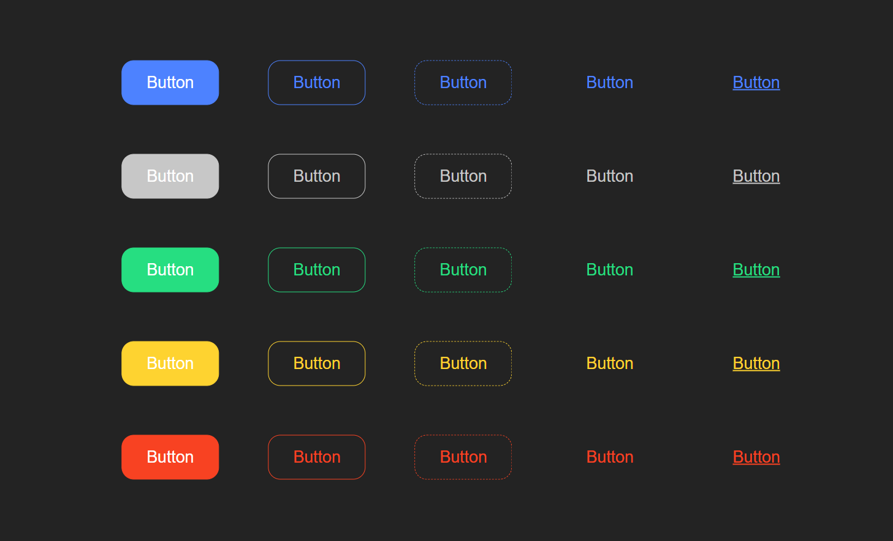

# fbg-button-ui

> Made with create-react-library

[](https://standardjs.com)




## Install

```bash
npm install --save fbg-button-ui
```

## Usage

```jsx
import React, { Component } from 'react'

import { Button } from 'fbg-button-ui'
import 'fbg-button-ui/dist/index.css'

const App = () => {
  return <Button color='primary' type='outline' text='Hello World!' />
}
```

## License

MIT © [fuatberke](https://github.com/fuatberke)
